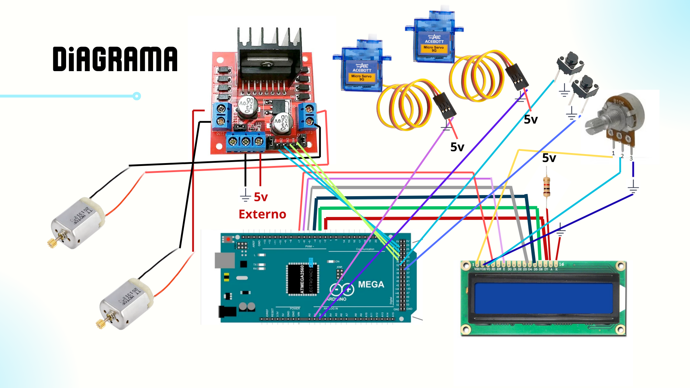

# Banda Electrica
## Descripción del Proyecto

Este proyecto consiste en el diseño e implementación de una cinta transportadora inteligente con capacidad de clasificación automatizada. El sistema utiliza un lazo de control basado en visión artificial simplificada (sensores fotométricos) para identificar y segregar objetos (cajas) según su firma cromática.
El flujo de trabajo inicia con el movimiento constante de la banda mediante actuadores de corriente continua (DC). Cuando un objeto entra en el campo de visión del sensor RGB, el sistema procesa los datos en tiempo real, normaliza las componentes de color y activa un mecanismo de desviación compuesto por dos servomotores. Estos servos actúan como compuertas lógicas físicas, redirigiendo cada caja hacia su contenedor correspondiente (Rojo, Azul o Amarillo), optimizando así el proceso de logística y separación de materiales.


## Especificaciones de Hardware (Requisitos)


Para la replicación del sistema, se requiere el siguiente inventario técnico:


- Unidad de Control: Arduino Mega 2560. Se selecciona por su amplia disponibilidad de puertos PWM y pines de interrupción, necesarios para gestionar múltiples actuadores y sensores simultáneamente.

- Sensor de Color: Adafruit TCS34725. Sensor de luz de color RGB con filtro IR, que permite una detección precisa mediante un bus de comunicación I^2C

- Actuadores de Clasificación: 2x Servomotores (SG90 o MG995). Encargados de la deflexión mecánica de las cajas. Su control por modulación de ancho de pulso (PWM) permite un posicionamiento angular exacto.
-	Sistema de Tracción: Motores de DC
-	Interfaz de Usuario: Pantalla LCD 16x2 para monitoreo de estado y Botones Industriales para el control de arranque/parada (Start/Stop).
-	Driver: Módulo L298N (Puente H): Actúa como un puente entre la batería y los motores. Recibe señales de baja potencia del Arduino y las convierte en señales de alta potencia para mover la banda.




## Dependencias de Software (Librerías)

Para el correcto funcionamiento del firmware, es imperativo instalar las siguientes bibliotecas en el entorno de desarrollo (IDE):

- Wire.h: (Nativa) Para la gestión del protocolo de comunicación
- Adafruit_TCS34725.h: Driver específico para el procesamiento de datos del sensor de color.
- LiquidCrystal.h: (Nativa) Para el control de la interfaz de cristal líquido.
- Servo.h: (Nativa) Para la generación de señales PWM (Modulación por Ancho de Pulso) de los servomotores.


## Instrucciones de Ejecución (Acceso al Main)

Apertura del Archivo: Localice el archivo proporcionado. Asegúrese de que el archivo tenga la extensión .ino. Si el archivo se llama main.ino, este debe estar dentro de una carpeta llamada exactamente main para que el IDE lo reconozca.

- Configuración de Placa: En el menú Herramientas, seleccione Placa: "Arduino Mega or Mega 2560" y el procesador ATmega2560.

- Conexión y Puerto: Conecte el Arduino mediante el cable USB y seleccione el puerto COM correspondiente en Herramientas -> Puerto.

- Compilación y Carga: Presione el botón de Verificar (icono de check) para validar la sintaxis y luego Subir (icono de flecha) para transferir el firmware al controlador.

Nota(en casos específicos): Se recomienda verificar las etapas de potencia de los motores DC de forma independiente para evitar ruidos electromagnéticos en la lectura del sensor RGB.


## Explicacion del codigo:

```cpp
#include "ColorSensor.h"

#include "Motor.h" //Libreria del motor dc

#include "ServoController.h" //Libreria de los servomotores 

#include "Display.h" //Libreria de la pantalla 

#include "ButtonControl.h" //Libreria de los push buttons 

// Esto incluye los funcionamientos de cada clase 

// Objetos

ColorSensor sensor;

Motor motor1(22, 24, 44); 

Motor motor2(26, 28, 45); // idenificar pines DC

ServoController servos;

Display lcdDisplay(7, 6, 5, 4, 3, 2);  //Identificar pines de Pantalla LCD

ButtonControl botones(32, 34); //Identificar pines de los push buttons 

//Aqui tambien va explicado las conexiones al arduino mega que utilizamos 

void setup() {

    Serial.begin(9600);

    lcdDisplay.begin();

    botones.begin();       

    motor1.begin();

    motor2.begin();

    servos.begin(12, 13);

    if(sensor.begin()) {

        Serial.println("Sensor OK");

    } else {

        Serial.println("Error Sensor");

        while(1);

    }

}

void loop() {               //  Controlas todo el mecanismo del circuito para el funcionamiento de la banda 

                            //  Electrica 

    botones.update();

    String color = sensor.readColor();

    if(botones.active) {

        motor1.forward(200);

        motor2.forward(200);

    } else {

        motor1.stop();

        motor2.stop();

    }

    servos.moveByColor(color);

    lcdDisplay.showColor(color);

    Serial.println(color);

    delay(200);

}

```
